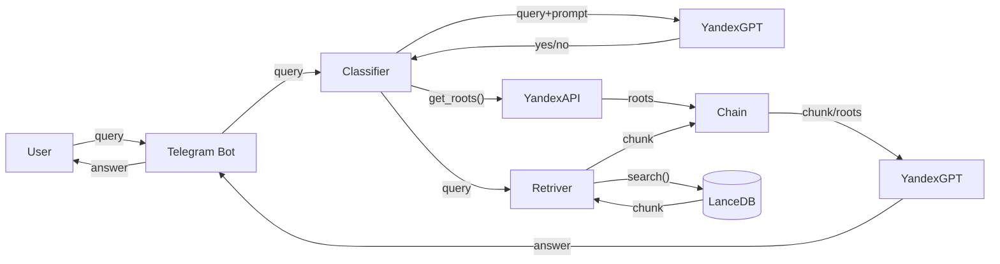

# Разговорный чат-бот для пассажиров РЖД

В последнее время, с появлением больших языковых разговорных моделей (Large Language Models, LLM) всё более актуальным и интересным вызовом становится создание предметно-ориентированных чат-ботов, то есть таких, которые способны поддерживать беседу в рамках определённой области, в частности, отвечать на интересующие пользователя вопросы. 

{расказать почему выбрали РЖД}

## Классический чат-бот
Основным методом для работы с LLM был выбран [RAG (Retrieval-Augmented Generation)](https://habr.com/ru/articles/772130/). Он предполагет дополнение запросов пользователей информацией из внешних источников данных, таких как текстовые документы или базы знаний, путем поиска и извлечения релевантных фрагментов текста (чанков), и их последующей подачи на вход языковой модели вместе с запросом пользователя. Таким образом, модель получает **дополнительный контекст**, что повышает качество и точность ее ответов.

Прежде всего необходима база знаний РЖД. Она была создана в несколько этапов:
1. сбор данных с веб-сайта РЖД о расписаниях поездов, статусах отправлений, билетных ценах и т.д.
2. обработка данных (очистка, разбиение на смысловые отрезки) с использованием LLM, таких как **Gemini** или **Claude**
3. векторизация данных с помощью **YandexEmbedings** 
4. сохранение векторов в специальном хранилище [LanceDB](https://lancedb.com/)

Затем при комбинации библиотек [LangChain](https://www.langchain.com/) и [YandexChain](https://github.com/yandex-datasphere/yandex-chain) был составлен классический конвеер RAG:
* **Retriever**: поиска релевантных чанков по косинусному сходству
* **PromptTemplate**: структурирование запросов
* **StuffDocumentChain**: “упаковка” документов в запрос
* **YandexGPT**: основной LLM

В итоге архитектура технологии выглядела примерно как на схеме:

## Тестирование
Для тестирования были взяты 10 самых часто задаваемых вопросов с сайта РЖД, а также ответы к ним. Вопросы были пропущены через описанную выше технологию RAG, а полученные ответы дополнили тройку `(вопрос; ответ ржд; ответ RAG)`. 

Далее ответ с сайта РЖД был взят как эталонный, ответ RAG как тестовый, оба были векторизированы. Затем между ними было рассчитано косинусное сходство (как между векторами), данный показатель и стал мерой сравнения двух ответов. 

Для наглядности была построена матрица сравнения, где ответы RAG были сравнены по косинусу не только с соответствующим идеальным ответом, но и с другими, в качестве доказательства, что мера сравнения объективна. По итогу по диагонали видно насколько соответствуют ответы RAG идеальным ответам. 

`Средний показатель схожести ответа ≈0.78.`

Тем не менее были выявлены недостатки. Созданная технология оказалась не способна выдавать релевантные ответы на запросы к динамическим данным, **к расписанию поездов**.

Например, на следующие вопросы были получены такие ответы:

`Когда ближайший поезд из Москвы в Санкт-Петербург?`
> По вашему запросу я не могу предоставить точную информацию о расписании поездов из Москвы в Санкт-Петербург, так как в предоставленных данных нет соответствующей информации.

`Мне нужно расписание поездов из Новороссийска в Воронеж на 15 июня.`
> К сожалению, я не нашел в предоставленных данных конкретного расписания поездов из Новороссийска в Воронеж на 15 июня. Однако я могу предоставить общую информацию о маршрутах и услугах РЖД.

## API Яндекс.Расписаний

Было принято решение об использовании [API Яндекс.Расписаний](https://yandex.ru/dev/rasp/raspapi/) в контексте создания разговорного чат-бота для возможности получения актуальных расписаний поездов, поиска поездов по заданным параметрам, предоставления информации о маршрутах и обновленной информации в реальном времени.

## Классификатор

Изначальная версия промпта: 
> Ты умный ассистент, который отвечает на сообщения пользователя и вопросы про РЖД.
Ты анализируешь запросы пользователя и предоставленный текст, но не упоминаешь о них в своем ответе!
Если пользователь СПРАШИВАЕТ ЧТО-ТО СВЯЗАННОЕ с РЖД и железными дорогами в целом, то ответь пользователю максимально информативно.
Если пользователь СПРАШИВАЕТ ЧТО-ТО НЕ СВЯЗАННОЕ с РЖД и железными дорогами в целом или в данных НЕТ ответа на его вопрос, тогда ПРОИГНОРИРУЙ ДАННЫЕ и ответь пользователю на интересующий его запрос.

Промежуточная версия промпт:
> Проанализируй запрос пользователя и дай ответ в формате обычного текста без форматирования markdown. Ты анализируешь запросы и предоставленные данные, но не упоминаешь о них в своем ответе Сделай вид, что ты отвечаешь конкретно мне. В твоем ответе НИЧЕГО КРОМЕ ответа на вопрос пользователя. Если вопрос пользователя ВООБЩЕ НЕ СООТНОСИТСЯ с данными, то проигнорируй их. Если пришли данные про Рейс, Отправление, Прибытие, Дата отправления, Время отправления, Местное время прибытия, то просто скажи: "Конечно! Вот, смотрите:" и не обращай внимание на дату.
> Вопрос пользователя:
>
> {query}
>
> Данные:
>
> {context}
>
> Дополнительная информация:

Финальная версия промпта:
> Ты умный ассистент, который отвечает на сообщения пользователя в формате чат-бота.\n
> У тебя есть информация о сегодняшней дате и времени: {str(today_date)} и {str(today_time)}.\n
> Далее тебе нужно понять, НУЖНО ЛИ пользователю расписание поездов или нет.\n
> Если пользователю НУЖНО расписание поездов, то верни ответ в формате, который будет в примерах запросов и ответов ниже.
> Если пользователь не указал, откуда и куда ему нужно, то уточни эти данные.
> Если пользователь явно не указал дату, то попробуй высчитать ее на основе информации о сегодняшнем дне.\n
> Если пользователю НЕ НУЖНО расписание поездов, то продолжи отвечать на запросы пользователя в режиме чат-бота.\n
> Примеры запросов и ответов, когда пользователю нужно расписание:\n
> 1) Пользователь: Когда поезд из Липецка в Москву? YaGPT: РАСПИСАНИЕ, Липецк, Москва, дата не указана, поезд.\n
> 2) Пользователь: Ближайший поезд от Ростова до Воронежа на завтра? YaGPT: РАСПИСАНИЕ, Ростов-на-Дону, Воронеж, {today_date + datetime.timedelta(days=1)}, поезд.\n
> 3) Пользователь: Какие поезда есть из Новороссийска в Россошь 17 мая? YaGPT: РАСПИСАНИЕ, Новороссийск, Россошь, 2024-05-17, поезда.\n
> 4) Пользователь: Мне нужно расписание поездов из Владивостока в Уссурийск через месяц? YaGPT: РАСПИСАНИЕ, Владивосток, Уссурийск, {today_date + datetime.timedelta(days=30)}, поезда.\n5)
> 5) Пользователь: Будут ли поезда из Новосибирска в Хабаровск через год? YaGPT: РАСПИСАНИЕ, Новосибирск, Хабаровск, {today_date + datetime.timedelta(days=365)}, поезда.\n
> 6) Пользователь: Поезда из мск в уссур. YaGPT: РАСПИСАНИЕ, Москва, Уссурийск, дата не указана, поезда.\n
> 7) Пользователь: Хочу добраться из астрахани в волгоград. YaGPT: РАСПИСАНИЕ, Астрахань, Волгоград, дата не указана, поезда.

Принятые кардинальные (советы) изменения:
*  fe

{описать что за таблица и как до неё дошло}
| Запрос | Изначальная версия классификатора | Финальная версия классификатора |
|--------------|-----------|------------|
| Когда ближайший поезд из Москвы в Санкт-Петербург? | БЛИЖАЙШИЙ, Москва, Санкт-Петербург | РАСПИСАНИЕ,       Москва, Санкт-Петербург, дата не указана, поезд. |
| Мне нужно расписание поездов из Новороссийска в Воронеж на 15 июня. | ДАТА, Новороссийск, Воронеж, 2024-06-15 | РАСПИСАНИЕ, Новороссийск, Воронеж, 2024-06-15, поезда. |

В доказательство корректной работы классификатора: 

`Когда ближайший поезд из Москвы в Санкт-Петербург?`
> Конечно, я могу помочь вам с информацией о ближайших поездах из Москвы в Санкт‑Петербург.
Ближайшим поездом из Москвы в Петербург является поезд № 754A, отправление из Москвы (Ленинградский Вокзал) в 05:55, местное время прибытия — 09:42.
Поезд прибудет на Московский вокзал Санкт-Петербурга.
Этот поезд отправляется каждый день.

`Мне нужно расписание поездов из Новороссийска в Воронеж на 15 июня.`
> Конечно, я могу помочь вам с поиском расписания поездов из Новороссийска до Воронежа на 15 июня 2024 года.
> Расписание поездов по вашему запросу выглядит так:
> 1. Рейс 234C из Новороссийска отправляется в 09.50 и прибывает в Придачу (Воронеж-Южный), местное время прибытия — 04.13.
> 2. Рейс 126C отправляется в 13.40 и прибывает туда же, местное время прибытия 08.15.
> 3. Рейс 506C отправляется из Новороссийска и прибывает на станцию Воронеж-1, местное время — 12.27.

## Имплементация

{рассказать про bot.polling и библиотеку}

## Общая архитектура

{немного про архитектуру}

## Команда проекта

* [Брежнева Алена](https://github.com/alenka192003)
* [Васильев Владимир](https://github.com/SilentMiver)
* [Дьяченко Юрий](https://github.com/YurDuiachenko)
* [Замуруев Роман](https://github.com/Zamuruev)
* [Карпушин Андрей](https://github.com/recwayer)
* [Левшенко Денис](https://github.com/kottzi)

## Источники

* [Retrieval-Augmented Generation](https://habr.com/ru/articles/772130/)
* [Yandex API Расписаний](https://yandex.ru/dev/rasp/raspapi/)
* [PromptEngineering4Devs](https://github.com/yandex-datasphere/PromptEngineering4Devs)
* [Создаём вопрос-ответного чат-бота (potter-bot)](https://github.com/yandex-datasphere/yatalks-potter-bot)
* [Yandex-chain](https://github.com/yandex-datasphere/yandex-chain)
* [Оцениваем RAG-пайплайны](https://habr.com/ru/articles/778166/)
* [Добавление собственных данных в LLM с помощью RAG](https://habr.com/ru/companies/wunderfund/articles/779748/)
